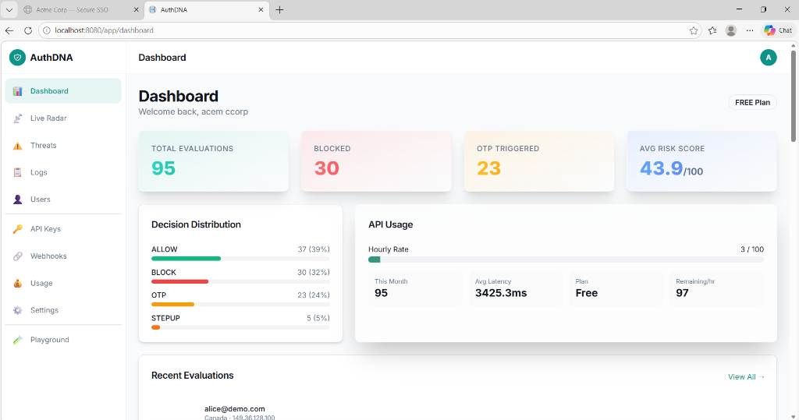
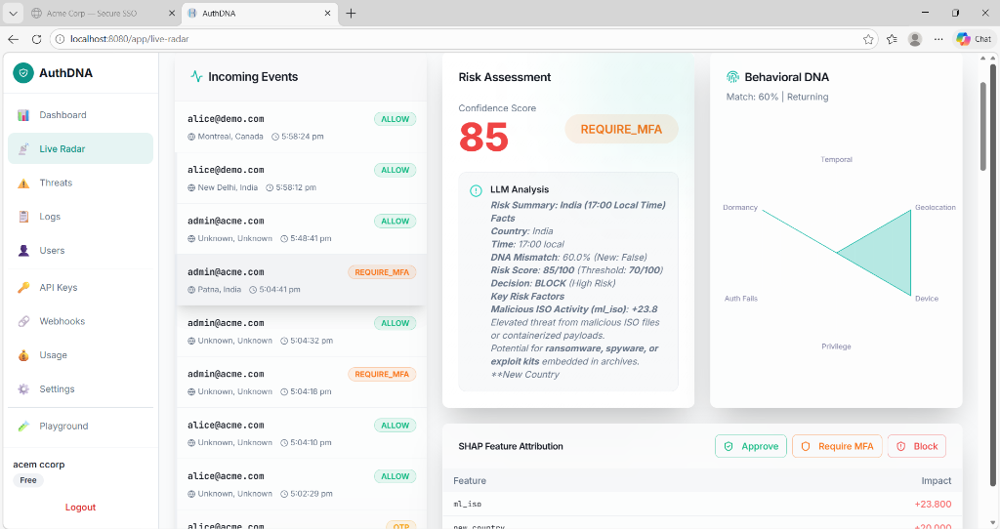
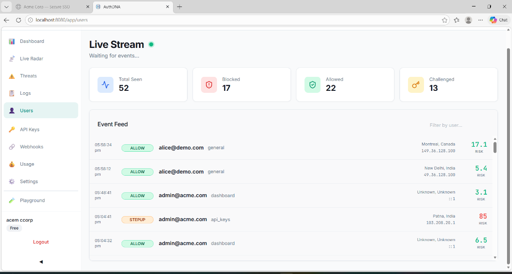
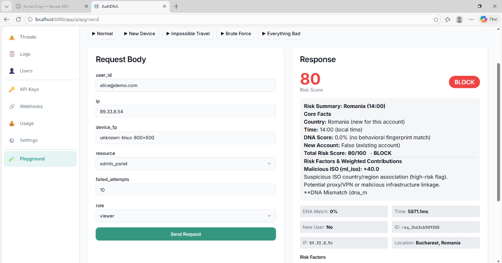

# AuthDNA: Adaptive Behavioral Identity Risk Engine

AuthDNA is a next-generation Identity and Access Management (IAM) framework that moves beyond static, rule-based security. It builds a unique **Behavioral DNA Fingerprint** for every user, enabling real-time detection of credential theft, session hijacking, and insider threats by verifying not just *what* the user knows (password), but *how* they behave.

## 📺 Project Showcase

| Dashboard Overview | Live Risk Radar |
|:---:|:---:|
|  |  |

| Users Stream | Threat Playground (Block) |
|:---:|:---:|
|  |  |

## 🚀 Key Innovation: The 4-Engine Architecture

AuthDNA evaluates every login attempt through four specialized AI engines to produce a single, explainable risk score (0-100).

### 1. 🧬 DNA Engine (Behavioral Fingerprinting)
Encodes a user's verified historical patterns into a fixed-length vector across six dimensions: **Temporal, Geolocation, Device, Privilege, Auth Failures, and Dormancy**.
- **DNA Drift Detection**: Distinguishes between natural life changes and sudden account takeovers.
- **Confidence Scoring**: Adjusts strictness based on the volume of historical data available for a user.

### 2. 🧠 ML Engine (Anomaly Detection)
Uses a hybrid approach with two high-performance models:
- **XGBoost**: Trained on global attack patterns to recognize known credential stuffing and bot behaviors.
- **Isolation Forest**: An unsupervised model that flags "outliers"—behaviors that have never been seen before for a specific user.

### 3. 🕸️ Graph Engine (Privilege Gap Analysis)
Analyzes the relationship between the user's role and the resource they are accessing. It computes a **Privilege Gap Score** to detect if a compromised account is being used to "nose around" sensitive areas outside its normal scope.

### 4. 🤖 LLM Explainer (Human-Readable Trust)
Security teams often struggle with "black box" AI. AuthDNA uses an LLM (Mistral/GPT) to translate raw SHAP feature importance values into natural language explanations.
- *Example*: "Blocked login from Pune, India at 3 AM. This is an impossible travel anomaly (last seen in London 2 hours ago) using a new Linux device."

---

## 🛠️ Tech Stack

- **Backend**: FastAPI (Python 3.11+), Appwrite (Database & Auth Management), XGBoost, Scikit-Learn.
- **Frontend**: React 18, Tailwind CSS, Recharts (Dynamic DNA Viz), Lucide Icons.
- **Real-time**: Server-Sent Events (SSE) for sub-second security log streaming.
- **Explainability**: SHAP (SHapley Additive exPlanations) for per-feature impact breakdown.

---

## 🏗️ Project Structure

```bash
AuthDNA/
├── backend/          # FastAPI server, ML engines, and DB services
├── frontend/         # React Admin Dashboard (Security Hub)
├── company-demo/     # Node.js sample app showing API integration
└── sdk/              # Client-side telemetry collection script
```

---

## ⚡ Quick Start

### 1. Backend Setup
```bash
cd backend
pip install -r requirements.txt
# Set your Appwrite & Mistral keys in .env
python utils/init_db.py  # Initialize Appwrite collections
uvicorn main:app --reload
```

### 2. Frontend Setup
```bash
cd frontend
npm install
npm run dev
```

### 3. Run the Demo
```bash
cd company-demo
npm install
node server.js
```

---

## 🛡️ Administrative Security & HITL

AuthDNA includes a **Human-in-the-Loop (HITL)** persistence layer. Admins can monitor the **Live Risk Radar** and manually override AI decisions in real-time.
- **Approve**: Whitelists the current behavior for 1 hour.
- **Require MFA**: Automatically steps up the user's next login attempt.
- **Block**: Hard-blocks the specific device fingerprint and IP.

These decisions are **persistent**. The backend automatically updates the original login audit trail and remains synced across page refreshes.

---

## 📈 Repository
Original Repository: [https://github.com/Pratham16CS/AuthDNA.git](https://github.com/Pratham16CS/AuthDNA.git)
